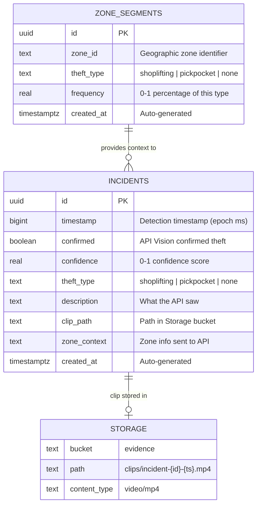
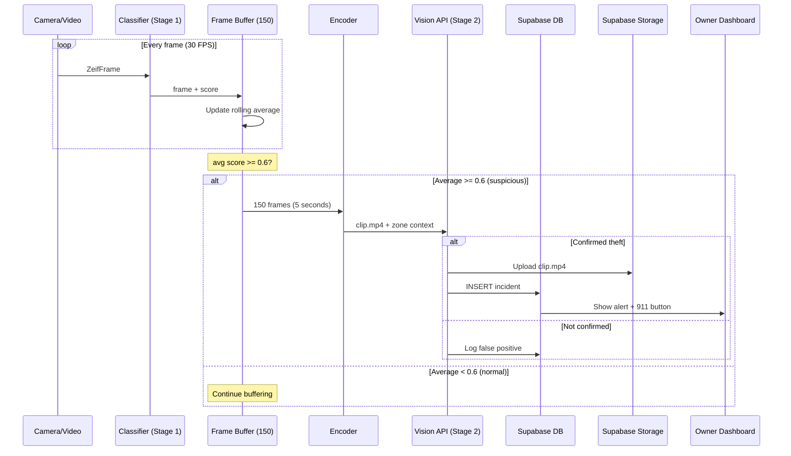
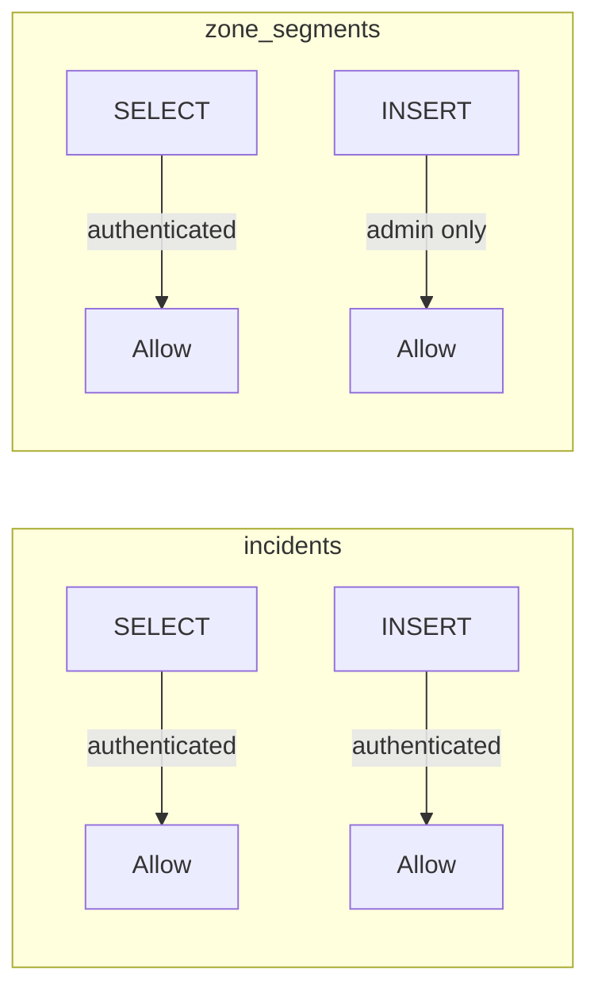

# Zeif Database — Entity Relationship Diagram

## ER Diagram

## Detection Pipeline Flow

## RLS Policies

## Notes

- View these diagrams on GitHub (renders Mermaid natively) or paste into [mermaid.live](https://mermaid.live)
- Storage is not a real table — it represents the Supabase Storage bucket
- The `zone_context` field in incidents is a text snapshot of the zone data at detection time, not a foreign key
