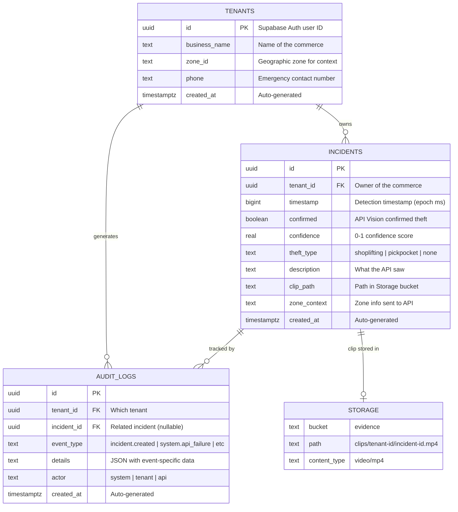
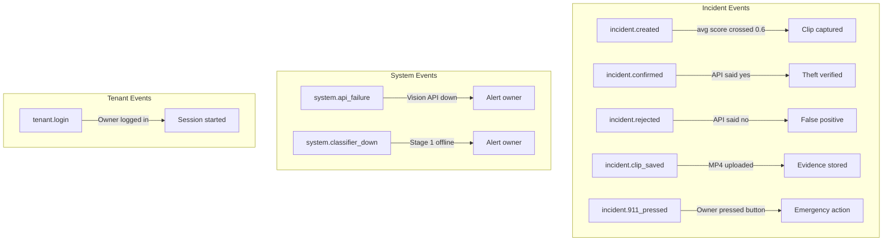
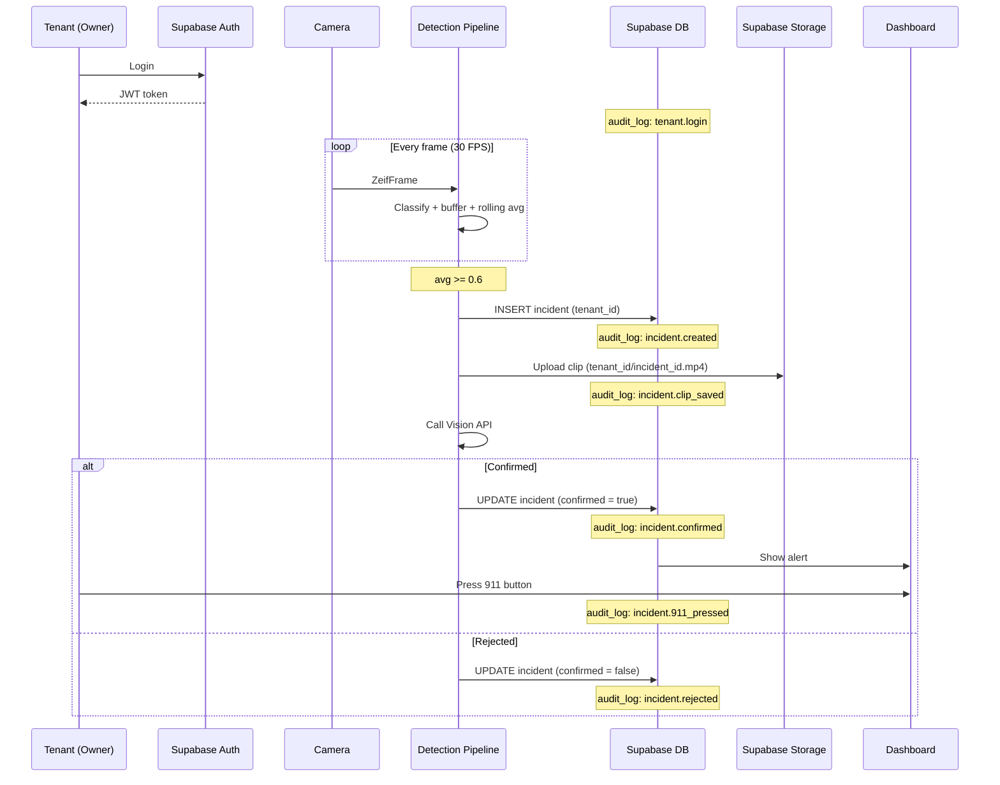
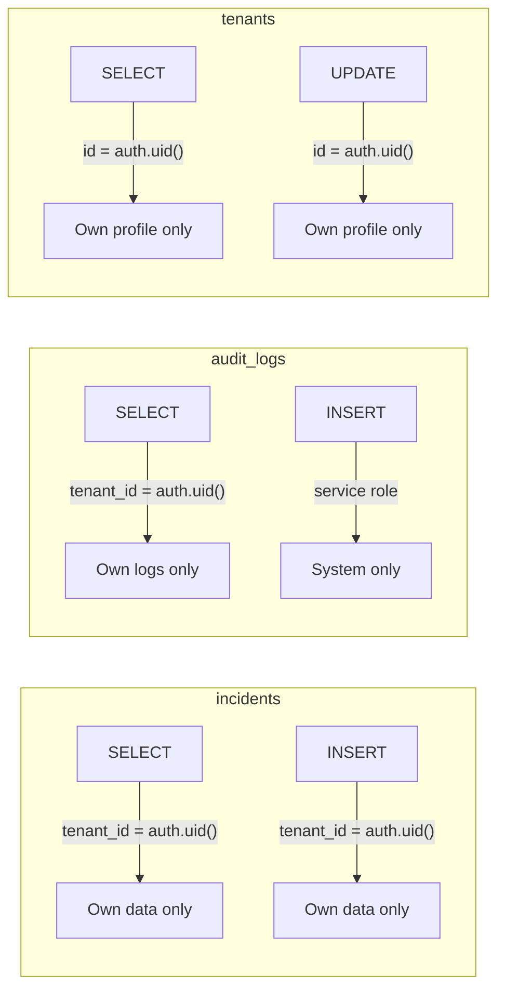

# Zeif Database — Entity Relationship Diagram

## ER Diagram

## Event Types

## Multi-Tenant Data Flow

## RLS Policies

## Notes

- **Supabase Auth** handles tenant authentication — `tenants` table extends the auth user with business info
- **Storage** is not a real table — it represents the Supabase Storage bucket, organized by tenant_id
- **audit_logs.incident_id** is nullable — system events (api_failure, classifier_down) don't have an incident
- **audit_logs.details** is a JSON text field for event-specific data (error messages, scores, etc.)
- **RLS ensures tenant isolation** — each owner only sees their own incidents, logs, and profile
- View these diagrams on GitHub (renders Mermaid natively) or paste into [mermaid.live](https://mermaid.live)
